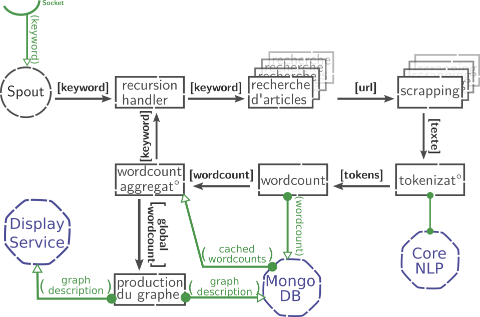

type: page
title: PROJECTS
menu-position: 1
---

# 1. Projet Congruence

Projet développé en binôme pendant ma formation Big Data. Le but du programme est d'explorer le champ sémantique associé à un mot dans des articles de journaux.

Le programme va tout d'abord effectuer des recherches sur des sites de news, récupérer et parser des articles pour en récupérer le contenu textuel. Ce contenu sera ensuite analysé à l'aide de l'outil CoreNLP, pour en extraire les personnes, organisations et sujets qui apparaissent le plus souvent. Une recherche de nouveaux est ensuite lancée récursivement à partir des sujets les plus fréquents.

La description d'un graphe est générée et mise à jour à chaque fois qu'un article est parsé, où les nœuds sont les mots qui apparaissent le plus souvent dans l'ensemble des articles, et les arrêtes relient les mots qui apparaissent simultanément dans un article.

Une interface web permet d'effectuer une recherche, puis d'afficher le graphe généré.

### Outils utilisés

 

  

 <ul>
  <li>Apache Storm (avec la librairie python Streamparse) pour la gestion du flux de données.</li>
  <li>MongoDB pour le  stockage de  donneés.</li>
  <li>Stanford CoreNLP pour l'extraction de tokens.</li>
  <li>Serveur Python/Flask pour l'API.</li>
  <li>HTML/javascript, librairie d3.js pour l'interface web</li>
</ul> 

<figure>
     
     <figcaption>Schéma flux de données -- Storm.</figcaption>
     </figure>

 

### Ressources

 * [Sources du projet](https://github.com/toane/Congruence)
 * [Vidéo de démonstration](https://www.youtube.com/watch?v=9vUKYk10r_k)

# 2. Projet Bocal

Projet Java 1.8 visant à implémenter une intelligence artificielle de groupe. Des poissons sont placés dans un bocal, ils doivent éviter les bords du bocal, ainsi que les autres poissons.

[Sources du projet](https://github.com/sapristi/bocal_java)

# 3. Projet Yaacs

Projet d'implémentation d'une chimie artificielle basée sur des réseaux de Pétri étendus.

### Ressources

 * [Sources du projet](https://github.com/sapristi/alife)
 * [Working demo](http://artlife.ml:51461)

# 4. Projet Easy_logging

Librairie de logs pour Ocaml.

 * [Documentation](/easy_logging/easy_logging)
 * [Source](https://github.com/sapristi/easy_logging)